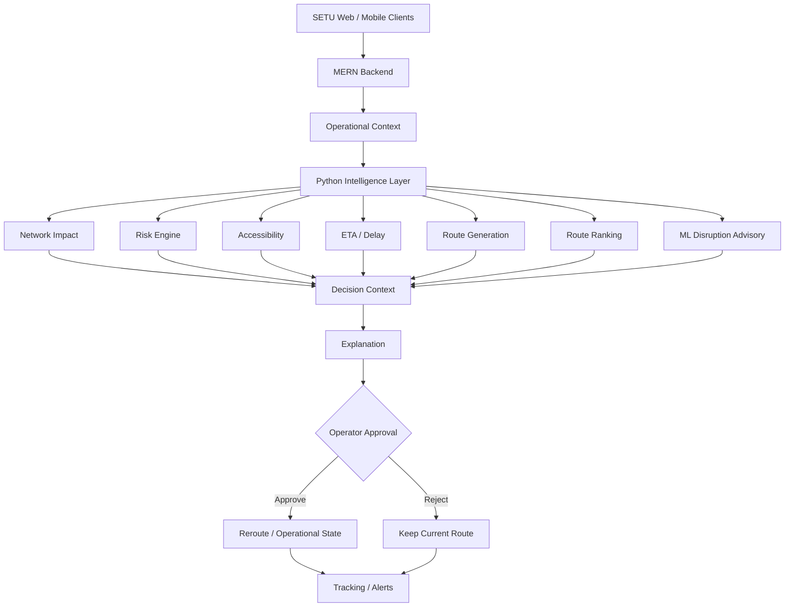
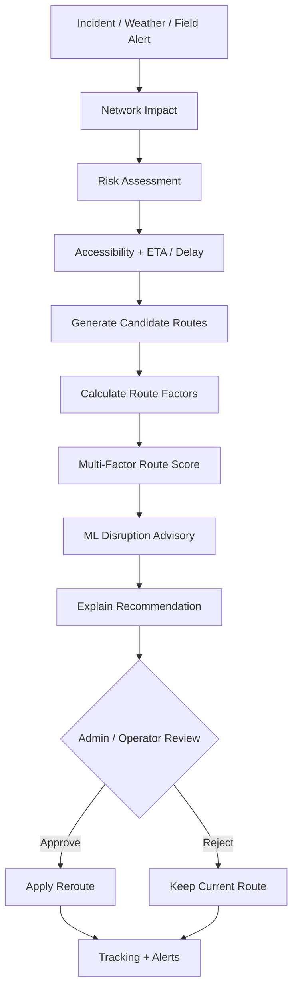
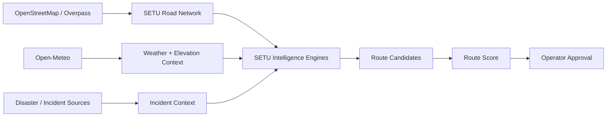
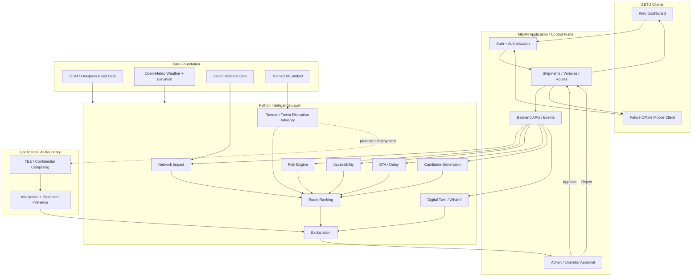

# SETU

### AI-Based Smart Logistics & Accessibility Intelligence Platform for the North Eastern Region

SETU is a disruption-aware logistics decision-support platform designed around **SIH26002 — AI-Based Smart Logistics and Accessibility Intelligence Platform for North Eastern Region (NER)**.

SETU is not simply a route planner. It helps logistics operators understand **what is happening to a transportation network, how that affects a shipment, what alternatives are practical, why one alternative is better, and whether the operator should approve the change**.

> **SETU turns a changing road condition into an evidence-backed, explainable and human-approved logistics decision.**

The core operating principle is:

**AI recommends → Backend orchestrates → Operator approves → SETU executes.**

---

## 1. The Problem Statement

### SIH26002

**Title:** AI-Based Smart Logistics and Accessibility Intelligence Platform for North Eastern Region (NER)  
**Organization:** Ministry of Development of North Eastern Region (MDoNER)  
**Theme:** Transportation & Logistics

### The problem in simple words

The North Eastern Region faces major logistics and accessibility challenges because transportation networks operate through **difficult terrain, extreme weather, limited connectivity and frequent road disruptions**.

Landslides, floods, heavy rainfall, road damage, incidents and infrastructure gaps can make a route that was previously usable slow, risky or inaccessible. When essential goods such as **medicines, food supplies, construction materials and agricultural produce** are moving toward remote districts, these disruptions can lead to:

- delayed deliveries;
- supply shortages;
- increased transportation cost;
- unreliable travel-time estimates;
- poor visibility of remote routes;
- slow response to road disruptions; and
- difficulty choosing an appropriate alternative route.

The problem statement calls for an AI-enabled platform combining **AI/ML, GIS mapping, weather data and real-time field inputs** to improve transportation visibility and planning across the NER.

It specifically expects capabilities around:

1. monitoring road, bridge and transport accessibility;
2. predicting possible route disruptions;
3. suggesting alternate routes and estimating delays;
4. GPS-based vehicle tracking;
5. alerts for blocked roads, inaccessible regions, delayed deliveries and high-risk corridors;
6. geo-tagged field reports, photographs and incident updates;
7. centralized logistics and accessibility dashboards; and
8. multilingual notifications and offline synchronization for low-network areas.

### What is missing from a conventional routing system?

A normal routing engine can answer:

> **“What is the shortest route from A to B?”**

But a logistics control room needs to answer:

> **What changed? Which road segments are affected? How serious is the disruption? Can the road still be practically used? How much delay could it cause? What alternatives exist? Which alternative is the best trade-off? Why is it better? Can the operator trust the recommendation enough to approve it?**

SETU is built around this complete decision problem.

---

## 2. What We Are Building

SETU is a **full logistics intelligence and decision-support layer** connecting operational data, road-network intelligence, environmental conditions, AI/ML and human decision-making.

It is structured into five major layers:

```text
┌─────────────────────────────────────────────────────────┐
│                    SETU APPLICATION                     │
│  Shipments • Operators • Tracking • Dashboards • APIs  │
└───────────────────────────┬─────────────────────────────┘
                            │
                            ▼
┌─────────────────────────────────────────────────────────┐
│                LOGISTICS INTELLIGENCE                    │
│ Impact • Risk • Accessibility • ETA • Weather • Routes │
└───────────────────────────┬─────────────────────────────┘
                            │
                            ▼
┌─────────────────────────────────────────────────────────┐
│                    AI / ML LAYER                         │
│        Disruption Assessment + Route Advisory           │
└───────────────────────────┬─────────────────────────────┘
                            │
                            ▼
┌─────────────────────────────────────────────────────────┐
│             SECURE INTELLIGENCE LAYER                    │
│        TEE • Attestation • Protected AI Processing      │
└───────────────────────────┬─────────────────────────────┘
                            │
                            ▼
┌─────────────────────────────────────────────────────────┐
│               DECISION & CONTROL LAYER                   │
│ Explanation → Human Approval → Reroute → Tracking       │
└─────────────────────────────────────────────────────────┘
```

### High-level architecture



The important architectural separation is:

**Prediction ≠ Recommendation ≠ Operational Authority.**

The AI can provide evidence and an advisory. The backend controls workflow. The authorized operator controls the final operational route change.

---

## 3. How SETU Solves the Problem

When a disruption occurs, SETU converts it into a structured decision process.



### The result

Instead of returning only a route, SETU can return a decision context containing:

- affected network context;
- risk and contributing factors;
- weather severity;
- infrastructure accessibility;
- expected delay;
- alternative routes;
- route scores and trade-offs;
- ML disruption advisory;
- explanation; and
- an explicit approval state.

---

## 4. SETU Product Components

### 4.1 Road Network Intelligence

SETU creates a structured road network from **OpenStreetMap (OSM)** data for the Guwahati–Imphal study corridor and surrounding network.

The core network contains **8,007 major-road segments**.

This road graph is the physical foundation for accessibility analysis, network impact, ETA calculation and alternative route generation.

### 4.2 Network Impact Engine

A geolocated incident is projected onto the road network using spatial proximity and an impact radius.

The engine identifies **potentially affected road segments**.

A critical safety rule is:

> **Potentially affected ≠ confirmed blocked.**

Being close to an incident does not automatically prove that a road is physically impassable. Explicit operational confirmation is required before a segment is treated as blocked.

### 4.3 Weather Intelligence

SETU uses historical and live/cached weather information including:

- precipitation;
- rainfall duration;
- temperature;
- wind;
- wind gusts; and
- WMO weather codes.

Weather contributes to deterministic risk assessment and to the ML feature set.

### 4.4 Risk Engine

The deterministic Risk Engine combines six normalized inputs:

- incident severity;
- weather severity;
- accessibility risk;
- road-condition risk;
- network criticality; and
- current delay ratio.

The exact score is:

```text
risk_score = 100 × (
    0.30 × incident_severity
  + 0.20 × weather_severity
  + 0.15 × accessibility_risk
  + 0.15 × road_condition_risk
  + 0.10 × network_criticality
  + 0.10 × current_delay_ratio
)
```

where:

```text
accessibility_risk = 1 - accessibility_score
road_condition_risk = 1 - road_condition_score
```

The resulting score is interpreted as:

| Score | Band |
|---:|---|
| 0–24.99 | LOW |
| 25–49.99 | MEDIUM |
| 50–74.99 | HIGH |
| 75–100 | CRITICAL |

### What the risk score actually means

The risk score is **not a black-box AI number**. It is a deterministic operational risk signal whose contributing factors can be shown to the operator.

For example, a road can become high-risk because:

- a severe incident is close to the route;
- heavy rainfall or strong wind is present;
- the road has poor mapped accessibility;
- the road condition is degraded;
- the segment is important to network connectivity; or
- the shipment is already experiencing a significant delay.

The deterministic risk calculation remains authoritative. ML does not silently replace it.

### 4.5 Accessibility Intelligence

SETU evaluates mapped infrastructure characteristics such as road class, surface, lanes and speed-related attributes to produce an **OSM-derived accessibility proxy**.

> **Accessibility score = mapped infrastructure characteristics, not guaranteed real-time physical passability.**

### 4.6 ETA & Delay Engine

The ETA engine calculates baseline and disruption-aware travel time for different vehicle profiles.

It considers road characteristics, speed assumptions, surface effects, vehicle profile and disruption effects, with explicit handling for blocked segments.

### 4.7 Alternative Route Generation

SETU generates multiple feasible route candidates over the road graph rather than returning only one shortest path.

The routing engine is **internally computed from the SETU road graph**. It does not depend on Google Maps, Mapbox, OSRM or another external routing API for candidate generation.

Explicitly confirmed blocked segments can be excluded from candidate generation.

### 4.8 Route Ranking

This is where SETU goes beyond shortest-path routing.

Each candidate route is evaluated against five supported signals:

1. **ETA / travel time** — lower is better.
2. **Risk** — lower is better.
3. **Accessibility** — higher is better.
4. **Physical distance** — lower is better.
5. **Vehicle-profile compatibility** — higher is better.

The default relative weights are:

| Factor | Weight |
|---|---:|
| ETA | 30/95 ≈ 31.58% |
| Risk | 20/95 ≈ 21.05% |
| Accessibility | 20/95 ≈ 21.05% |
| Distance | 15/95 ≈ 15.79% |
| Vehicle compatibility | 10/95 ≈ 10.53% |

Before combining them, candidate values are converted into normalized utility scores so that different units—seconds, kilometres, risk points and 0–1 accessibility values—can be compared fairly.

Conceptually:

```text
Route Score =
    ETA Utility          × 30/95
  + Risk Utility         × 20/95
  + Accessibility Utility× 20/95
  + Distance Utility     × 15/95
  + Vehicle Utility      × 10/95
```

For cost factors such as ETA, risk and distance, **lower is better**. For benefit factors such as accessibility and vehicle compatibility, **higher is better**.

The route with the strongest overall normalized utility becomes the **rank-1 recommendation** among the generated candidates.

### 4.9 How a route is actually selected

The complete selection logic is:

```text
Incident / Alert / Changing Conditions
                │
                ▼
       Identify affected segments
                │
                ▼
      Calculate deterministic risk
                │
                ├── Incident severity
                ├── Weather
                ├── Accessibility
                ├── Road condition
                ├── Network criticality
                └── Current delay
                │
                ▼
        Estimate ETA / delay
                │
                ▼
       Generate route candidates
                │
                ▼
       Remove explicitly confirmed
          blocked segments
                │
                ▼
     Evaluate every candidate route
                │
       ┌────────┼─────────┐
       ▼        ▼         ▼
      ETA      Risk   Accessibility
       │        │         │
       └────┬───┴────┬────┘
            │        │
          Distance  Vehicle Fit
            │        │
            └────┬───┘
                 ▼
       Normalize route factors
                 │
                 ▼
        Weighted Route Score
                 │
                 ▼
        Rank candidate routes
                 │
                 ▼
       ML disruption advisory
                 │
                 ▼
       Explain best trade-offs
                 │
                 ▼
        ADMIN / OPERATOR REVIEW
                 │
          ┌──────┴──────┐
          ▼             ▼
       APPROVE         REJECT
          │             │
          ▼             ▼
      Apply route     Keep current
         change          route
```

**Important:** the current ML component is an advisory signal. It does not directly replace the deterministic ranking formula or autonomously select a route.

### 4.10 Explainable Recommendations

SETU does not stop at a numerical score. It produces structured explanations describing the factors and trade-offs behind a recommendation.

The operator can therefore understand **why** one alternative is preferred.

### 4.11 Digital Twin / What-If Simulation

A lightweight Digital Twin represents fleet, shipment, route and incident state and supports isolated what-if scenarios.

This lets SETU evaluate potential route decisions without mutating the live operational state before approval.

### 4.12 Human-in-the-Loop Rerouting

A route recommendation enters:

`PENDING_APPROVAL`

The operational route is not changed until an authorized operator explicitly approves the recommendation.

If the operator rejects it, the current operational route remains unchanged.

---

## 5. External APIs & Data Sources

SETU deliberately separates **external data acquisition** from **internal route intelligence**.

| Source / API | Used for | Role in SETU |
|---|---|---|
| **OpenStreetMap / Overpass API** | Road geometry and road attributes | Builds the road-network foundation |
| **Open-Meteo** | Historical/live or cached weather and elevation enrichment | Supplies environmental and terrain context |
| **GDACS** | Disaster-data provenance in the prototype dataset | Referenced as a source for the dataset methodology; current prototype does not fabricate local events when a usable event feed is unavailable |
| **SETU internal routing engine** | Candidate route generation | Generates routes from the local road graph; no external routing API is required |
| **SETU deterministic engines** | Impact, risk, accessibility, ETA and ranking | Internal, reproducible decision logic |

### Important API principle

SETU does **not** call an external routing service every time a route decision is made. The road network is acquired and normalized into the SETU data foundation, and route candidates are generated from that graph locally.

This reduces dependence on external routing availability and gives the decision layer deterministic, testable behaviour.

### Current prototype data flow



---

## 6. The AI / ML Layer

SETU's AI layer is intentionally **not an autonomous route controller**.

It consists of a deterministic intelligence foundation plus a supervised ML disruption-assessment component.

### Deterministic intelligence is the operational foundation

The deterministic layer provides:

- network impact;
- risk;
- accessibility;
- ETA/delay;
- route generation;
- route ranking;
- explanation; and
- Digital Twin state/what-if evaluation.

These components are explicit, testable and governed by defined contracts.

### ML provides an additional disruption signal

The supervised model provides an additional assessment of disruption conditions for road-segment contexts.

The model does **not**:

- declare a road closed by itself;
- replace the Risk Engine;
- change route-ranking weights;
- autonomously reroute a shipment; or
- bypass human approval.

The architecture is therefore:

```text
Deterministic Intelligence
          │
          ├───────────────┐
          │               │
          ▼               ▼
   Operational Data     ML Advisory
          │               │
          └───────┬───────┘
                  ▼
          Recommendation
                  │
                  ▼
             Explanation
                  │
                  ▼
           Human Approval
                  │
             Approve/Reject
                  │
                  ▼
          Operational Action
```

### AI vs route optimizer: the important distinction

The **route optimizer is not simply the ML model**.

SETU uses a layered decision architecture:

```text
ML Model
   │
   └──► Disruption evidence / advisory
                │
                ▼
Deterministic Decision Layer
   ├── Risk
   ├── Accessibility
   ├── ETA
   ├── Candidate generation
   └── Route ranking
                │
                ▼
       Best-ranked alternative
                │
                ▼
        Human explanation
                │
                ▼
        Admin / Operator
                │
        ┌───────┴────────┐
        ▼                ▼
     Approve           Reject
        │                │
        ▼                ▼
     Reroute          Keep route
```

This makes the system easier to audit: a judge or operator can distinguish **what the model predicted** from **why the route was ranked highly** and **who authorized the operational action**.

---

## 7. Our ML Model

### What model did we build?

SETU evaluates three supervised learning approaches:

1. Logistic Regression — baseline
2. Random Forest — nonlinear tree ensemble
3. HistGradientBoosting — gradient-boosted tree model

The **Random Forest** is selected as the current champion based on validation PR-AUC.

### Training data

The ML dataset contains **17,551,344 segment-day observations** across:

- **8,007 road segments**;
- **2,192 calendar days**;
- **2019–2024**; and
- **40 representative weather points**.

Each observation represents the condition/context of one road segment on one calendar day.

### Model features

The model uses a fixed **24-feature canonical input vector** containing:

- cyclical month encoding;
- cyclical day-of-week encoding;
- latitude;
- longitude;
- elevation;
- road-type rank;
- paved-surface indicator;
- lane count;
- connectivity proxy;
- accessibility score;
- weather-point distance;
- precipitation;
- rainfall;
- precipitation duration;
- temperature features;
- wind speed;
- wind gust;
- WMO weather code; and
- daily weather severity.

The exact feature contract is kept fixed between training and inference to avoid training/inference mismatch.

### Target label

The current target is `disruption_proxy`.

It is a **deterministically engineered prototype label** based on environmental/disruption thresholds and infrastructure conditions.

It is **not observed road-closure ground truth**.

This is a deliberate methodological disclosure.

### Why this matters

Because the target is derived from variables that also appear in the feature set, very high ML metrics are expected to demonstrate **rule-replication fidelity**.

They should not be presented as proof that SETU can predict real-world road closures with equivalent accuracy.

A future production-quality predictive model should be trained against observed outcomes such as confirmed closures, passability observations and verified incident consequences.

---

## 8. ML Training Methodology

SETU uses a chronological split:

| Dataset | Period | Role |
|---|---|---|
| Train | 2019–2022 | Model fitting |
| Validation | 2023 | Model and threshold selection |
| Test | 2024 | Final holdout evaluation |

This avoids randomly mixing years between training and evaluation.

### Model-selection metric

Because disruption events are relatively rare, **PR-AUC** is used as the primary model-selection metric, supported by:

- precision;
- recall;
- F1;
- ROC-AUC;
- confusion matrix;
- Brier score; and
- log-loss.

### Decision threshold

The Random Forest uses a frozen decision threshold of **0.30**.

The threshold is selected using the validation period and then frozen before the final test evaluation.

### Leakage controls

Operational outputs and target-derived information are excluded from the ML feature vector, including disruption labels, risk outputs, network-impact outputs, reroute recommendations and delay factors.

The linear baseline uses a scaler fitted only on training data; the Random Forest receives raw features.

---

## 9. ML Inference & Decision Integration

The trained model is exposed through a deterministic Python inference component: `DisruptionInferenceEngine`.

The inference contract includes:

- the exact 24-feature order;
- the Random Forest model artifact;
- the frozen 0.30 threshold;
- strict feature validation;
- strict WMO weather-code validation;
- segment-level disruption output; and
- route-level aggregation.

For a route, SETU can derive information such as:

- length-weighted mean disruption score;
- maximum segment disruption;
- disrupted-segment count; and
- segment-level predictions.

The ML advisory does not modify deterministic route generation or route-ranking weights.

If the model artifact is unavailable, the system does not invent a probability. The orchestration path can mark the advisory unavailable while the deterministic pipeline continues.

### ML inference inside the route decision

For each relevant road segment, the inference component constructs the exact 24-feature input vector and obtains a disruption probability from the trained Random Forest.

The probability is thresholded at **0.30** to produce the model's binary advisory, while the raw probability remains available as an evidence signal.

For a route, segment-level outputs can be aggregated using the route's physical segment lengths, allowing the operator to see whether risk is concentrated in one segment or spread across the route.

The ML output is therefore **supporting evidence**, not an automatic route-change command.

---

## 10. Secure AI Processing — Trusted Execution Environment

SETU is designed with a **Trusted Execution Environment (TEE)** as a security boundary for sensitive AI processing.

### What is a TEE?

A TEE is a hardware-backed isolated execution environment designed to protect code and data while they are being processed.

In simple terms:

> **The AI gets a protected computing room where sensitive data can be processed with stronger isolation from the normal host environment.**

TEE protection is particularly relevant when SETU is deployed in cloud or shared infrastructure and processes sensitive information such as:

- shipment information;
- vehicle/location data;
- incident information;
- route plans;
- ETA/operational context;
- sensitive model inputs; and
- protected model or key material.

### How it fits SETU

```text
SETU Backend
     │
     │ Authenticated + Authorized Request
     ▼
┌──────────────────────────────┐
│       TEE / CONFIDENTIAL     │
│          WORKLOAD            │
│                              │
│  Protected Inputs            │
│        ↓                     │
│  Feature Construction        │
│        ↓                     │
│  ML Inference                │
│        ↓                     │
│  Minimum Necessary Result    │
└──────────────┬───────────────┘
               │
         Attested Result
               ▼
        Backend / Operator
               │
               ▼
        Human Approval
```

### What we should implement

The production TEE design should include:

1. **Hardware-backed isolation** — run sensitive inference inside a supported confidential-computing environment.
2. **Remote attestation** — verify that the expected workload is running before releasing protected secrets or sensitive resources.
3. **Encrypted communication** — TLS remains required; TEE does not replace encryption in transit.
4. **Encrypted storage** — sensitive data remains protected at rest.
5. **Minimal plaintext exposure** — only the computation that requires plaintext should receive it.
6. **Protected model and inputs** — protect sensitive inference inputs and model material where supported.
7. **Attested secret release** — keys/secrets are released only after authorization and successful attestation.
8. **Measured workload identity** — approved workload versions should have a verifiable identity.
9. **Fail-closed behavior** — failed attestation or unexpected workload identity must not receive protected secrets.
10. **Security auditing** — record attestation and authorization events without logging sensitive payloads.

### TEE does not replace the security system

TEE is one security layer. SETU still requires:

- authentication;
- authorization;
- secure APIs;
- TLS;
- encrypted storage;
- secure device/mobile communication;
- access control;
- input validation; and
- audit logging.

Candidate confidential-computing technologies depend on deployment hardware and can include CPU technologies such as **Intel TDX** or **AMD SEV-SNP**, with compatible confidential-GPU technology considered only if future workloads require it.

The key security principle is:

> **Protect the data → attest the workload → execute sensitive AI → return the minimum necessary result → keep operational authority outside the model.**

---

## 11. End-to-End Operational Scenario

Consider a shipment travelling through a disruption-prone corridor.

### Step 1 — A disruption occurs

A field report, incident or changing environmental condition enters SETU.

### Step 2 — SETU identifies network impact

The incident is mapped to nearby road segments and potentially affected infrastructure is identified.

### Step 3 — SETU assesses risk

Incident severity, weather, accessibility, road condition, network criticality and current delay are evaluated using the deterministic Risk Engine.

### Step 4 — ETA impact is calculated

SETU estimates baseline and disruption-aware travel time for the shipment's vehicle profile.

### Step 5 — Alternatives are generated

The routing engine generates multiple feasible alternatives while respecting explicitly blocked segments.

### Step 6 — Alternatives are scored

Each candidate is evaluated using ETA, risk, accessibility, distance and vehicle compatibility. The normalized weighted route score produces the ranking.

### Step 7 — ML adds disruption evidence

The Random Forest provides an additional disruption assessment for relevant road segments and route context.

### Step 8 — Explanation is produced

SETU explains the important trade-offs instead of returning only a score.

### Step 9 — Admin / operator reviews

The recommendation enters `PENDING_APPROVAL`.

The control-room user can inspect the route, risk, ETA, accessibility, incident/alert context, ML advisory and explanation before making a decision.

### Step 10 — Admin / operator decides

- **Approve:** the route changes and operational state is updated.
- **Reject:** the current route remains active.

This creates a complete chain:

**Incident → Network Impact → Risk → ETA → Candidate Routes → Route Score → ML Evidence → Explanation → Human Approval → Reroute → Tracking**

---

## 12. GIS, GPS, Alerts & Field Operations

The product architecture is designed to connect intelligence with the operational capabilities expected by SIH26002.

### GIS

The road network and incidents are spatially represented so that route impact and accessibility can be evaluated geographically.

### GPS tracking

The broader SETU application is designed to consume vehicle location updates and associate them with shipment and route context.

### Alerts

The application can use intelligence outputs to surface high-risk corridors, disruption conditions, delay changes and rerouting recommendations to operators.

### Field reporting

A field client is intended to support geo-tagged incident information and operational updates from remote locations.

### Offline support

A future offline mobile application is intended for assigned shipments/routes, GPS updates, incidents, notifications and offline synchronization in low-connectivity areas.

The mobile layer is a **field client and synchronization layer**. AI intelligence remains server-side.

### Multilingual support

Multilingual notifications are part of the broader product direction so that field and operational users can receive actionable information in appropriate languages.

---

## 13. System Architecture

The complete logical architecture is:



### Application / control layer

The MERN application manages operational entities, users, authentication/authorization, shipment and route state, tracking, APIs, events and operator workflows.

### Intelligence layer

The Python layer performs deterministic network, risk, accessibility, ETA, routing and explanation calculations plus ML disruption assessment.

### Secure AI layer

The TEE provides a confidential-computing boundary for sensitive AI workloads where appropriate deployment hardware is available.

### Control layer

The backend and authorized operator retain operational authority. The model never becomes a route-change command by itself.

---

## 14. Data Foundation

### Road data

**Source:** OpenStreetMap / Overpass  
**Study area:** Guwahati–Imphal corridor and surrounding network  
**Core network:** 8,007 major-road segments

### Elevation

Representative spatial elevation enrichment provides terrain context for route intelligence and ML features.

### Weather

Historical weather foundation:

- 2019–2024;
- 40 representative weather points;
- 2,192 calendar days.

### ML dataset

17,551,344 segment-day observations combining spatial, road, accessibility and weather context.

### Data provenance principle

SETU does not fabricate disaster observations when a real local event source is unavailable. Prototype labels and proxy measurements are explicitly disclosed as such.

---

## 15. Safety, Explainability & Governance

SETU is intentionally designed so that uncertainty does not automatically become an irreversible operational action.

### Rule 1 — Affected does not mean blocked

Spatial proximity identifies potentially affected infrastructure. Confirmed blockage is a separate operational state.

### Rule 2 — ML does not override deterministic intelligence

ML is an advisory signal. Deterministic route generation, ranking and operational rules remain authoritative.

### Rule 3 — Human approval is mandatory

A recommendation remains `PENDING_APPROVAL` until an authorized operator explicitly approves it.

### Rule 4 — Invalid information is not silently fabricated

Missing models, invalid weather codes and invalid feature inputs should result in explicit validation/error states rather than invented values.

### Rule 5 — Security does not imply autonomy

Even protected inference inside a TEE has no authority to silently reroute a shipment.

---

## 16. Technology Stack

**Application:** MERN, React, Node.js/Express, Socket.IO where applicable  
**Intelligence:** Python 3.10, scikit-learn, NumPy, SciPy  
**Road data:** OpenStreetMap / Overpass  
**Weather:** Open-Meteo  
**ML:** Logistic Regression, Random Forest, HistGradientBoosting  
**Security architecture:** TLS + secure storage + TEE/confidential computing where deployed  
**Operational model:** deterministic intelligence + ML advisory + human approval

The architecture deliberately avoids adding Kafka, Redis or unnecessary ML microservices before there is a demonstrated operational need.

---

## 17. What Makes SETU Different

SETU's value is not one isolated algorithm. It is the **integration of intelligence into an operationally governed decision loop**.

| Conventional approach | SETU approach |
|---|---|
| Shortest route | Multi-factor operational route decision |
| Static map | Disruption-aware network context |
| Incident shown separately | Incident projected onto road network |
| Risk as an opaque score | Deterministic risk with contributing factors |
| Accessibility assumed | Explicit infrastructure accessibility proxy |
| One route | Multiple alternatives |
| Black-box recommendation | Explainable recommendation |
| ML makes decision | ML provides advisory evidence |
| Automatic reroute | Human-approved reroute |
| Data protected mainly at rest/in transit | Data-in-use can also be protected with TEE |
| Online-only field assumption | Future offline field synchronization |

---

## 18. Important Technical Limitations

SETU deliberately documents its current boundaries rather than hiding them.

### ML label limitation

The current disruption target is engineered from deterministic rules, not observed road-closure ground truth.

### ML metric limitation

Very high metrics therefore indicate rule-replication fidelity and should not be presented as real-world closure-prediction accuracy.

### Spatial generalization limitation

The current test period is an unseen year over the same underlying road network. It does not prove generalization to unseen roads or unseen regions.

### Accessibility limitation

The accessibility score is an OSM-derived infrastructure proxy, not a real-time passability guarantee.

### API / live-data limitation

External services are data inputs, not the route decision engine. Current route generation and ranking are designed to operate from the locally structured road graph and deterministic engines rather than requiring a live external routing API for every decision.

### TEE deployment limitation

TEE protection depends on deployment hardware, cloud/platform support, attestation infrastructure and correct key-management integration. It is an architectural security layer, not a claim that every development machine automatically provides confidential computing.

These limitations define the next scientific and engineering improvements rather than weakening the core architecture.

---

## 19. Future Evolution

The platform can evolve toward:

- observed road-closure and passability datasets;
- verified incident and disaster feeds;
- stronger real-time prediction;
- broader NER road coverage;
- production GPS/vehicle integration;
- offline-first mobile synchronization;
- multilingual field workflows;
- production-grade confidential computing and attestation;
- model monitoring and drift detection; and
- integration with government transport and monitoring systems.

The most important ML improvement is to move from **engineered disruption labels** toward **verified real-world outcomes**.

---

## 20. Project Structure

```text
SETU_AI/
├── src/
│   ├── data/           # OSM, weather and data-processing pipelines
│   ├── risk/           # Deterministic risk engine
│   ├── impact/         # Network impact analysis
│   ├── accessibility/  # Infrastructure accessibility
│   ├── eta/            # ETA and delay calculation
│   ├── digital_twin/   # State, events and what-if simulation
│   ├── routing/        # Route generation and ranking
│   ├── explanation/    # Explainable recommendations
│   ├── reroute/        # Incident-to-reroute orchestration
│   └── ml/             # ML training and inference
├── datasets/           # Dataset specifications and local data
├── models/             # Local/gitignored model artifacts
├── tests/              # Regression and component tests
├── README.md
├── HOW-TO-BUILD.md
└── TASK_TRACKER.md
```

---

## 21. The SETU Vision

SETU aims to become a practical bridge between **logistics operations, intelligent infrastructure analysis and secure AI decision support** for difficult and disruption-prone corridors.

The long-term vision is not simply to build another route planner.

It is to build a system that can:

**Understand the network → understand the disruption → quantify risk → estimate the consequence → generate alternatives → score the trade-offs → use ML as additional evidence → explain the recommendation → protect sensitive intelligence → let a human make the decision → execute and track the approved action.**

That is the role of SETU.